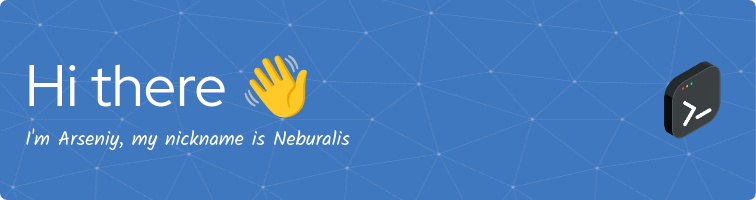

<!-- Copy from Neburalis/readme.md-->

__About me__
- I'm self-taught developer, I wrote my first program about 10 years ago. But despite this, my skills cannot be called high, but I am learning and trying to improve them.
- I don't have any big projects that I could write about here, but I do have ambitions, and maybe I'll be able to write something soon.
- I'm currently studying the backend. Django, fast api, PostgreSQL, sqLite and some more technologys.
- I mainly write in Python, but I also don't forbid myself from trying something new and exotic.
- I’m looking for help with ... I'm open to any help, you can always submit issues in any of my repos, or pull requests.
- If you have any questions for me, you can ask them [here](https://github.com/Neburalis/Neburalis/issues).
- Fun fact: I like translating documentation into my native language because firstly it improves my knowledge of English, and secondly I can help my compatriots.

usually other people here list technologies they are familiar with, but I am familiar with a lot of technologies, but I wouldn't say I am very good at them, so you can look at it in my repositories (and evaluate my skills in this technology) or on the banner below

